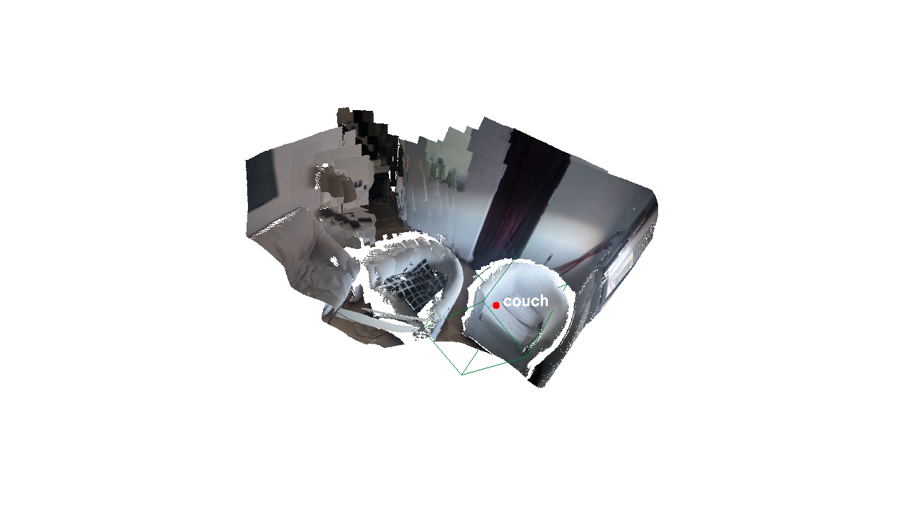
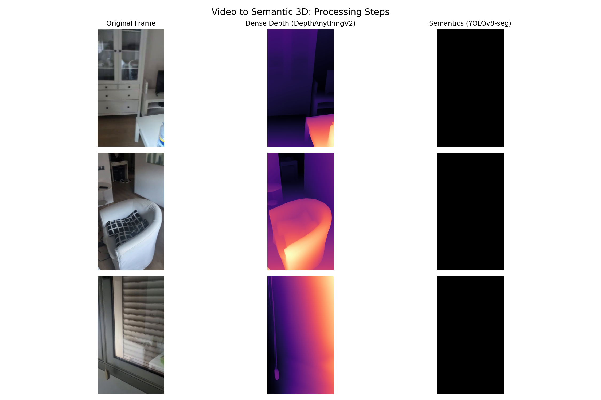
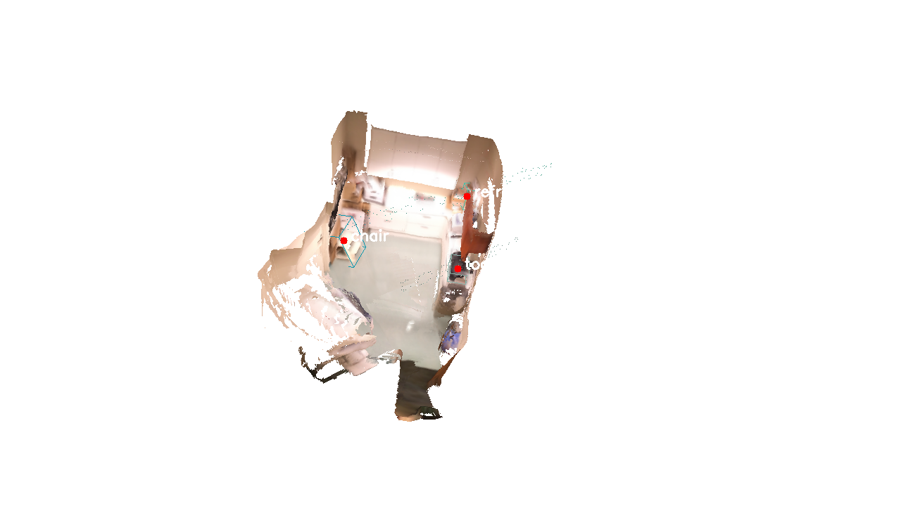
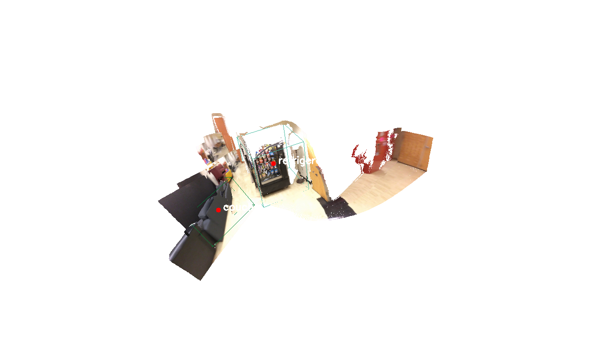
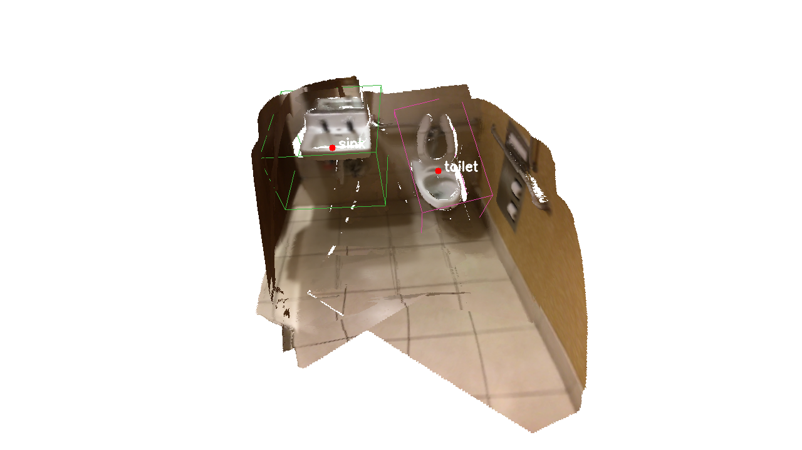
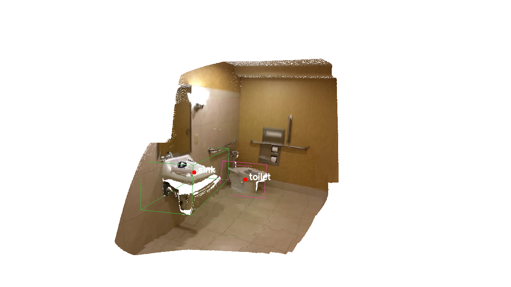
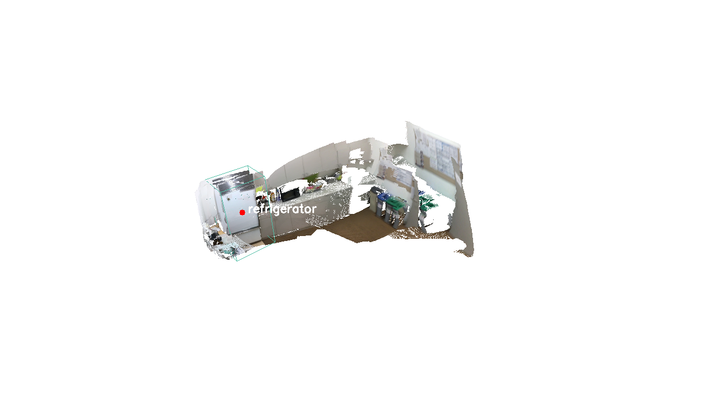

# 3D Scene Reconstruction and Semantic Mapping from Handheld Video

A complete, high-performance pipeline to recover metric 3D scene geometry and semantic object boundaries from a single casual video captured on a handheld device. By integrating classical Structure-from-Motion (SfM) with deep learning dense depth networks and 2D instance segmentation, the system builds geometrically consistent, watertight 3D color meshes and fits tight 3D Oriented Bounding Boxes (OBBs) around detected indoor furniture.

---

## Architectural Overview

The system operates through an optimized, six-stage pipeline that transitions raw video frames into a structured, semantically enriched 3D coordinate space.

```
[Raw Handheld Video]
         │
         ▼
 1. Video Processing ────► Extracts keyframes and filters motion blur
         │
         ▼
 2. Sparse SfM Tracking ──► Recovers camera poses & sparse metric keypoints (pycolmap)
         │
         ▼
 3. Dense Depth Inference ──► Predicts relative frame-wise depth (DepthAnythingV2)
         │
         ▼
 4. Instance Segmentation ──► Extracts 2D instance semantic masks (YOLOv8-seg)
         │
         ▼
 5. Volumetric TSDF Fusion ──► Solves metric scale alignment & integrates color volume (Open3D)
         │
         ▼
 6. Spatial DBSCAN Clustering ──► Filters outlier noise and fits 3D Oriented Bounding Boxes (OBB)
```

1. **Keyframe Extraction**: Decimates raw video to a uniform frame rate, discarding frames with severe motion blur to ensure robust downstream tracking.
2. **Sparse SfM Tracking**: Processes keyframes through classical feature extraction, matching, and incremental reconstruction to establish a scale-consistent coordinate space and camera trajectory.
3. **Dense Depth Inference**: Predicts dense, high-resolution relative depth maps for all tracked keyframes using a robust transformer-based foundation model.
4. **2D Instance Segmentation**: Identifies and segments object classes per frame, establishing pixel-level boundary masks.
5. **Scale Alignment & TSDF Fusion**: Anchors the relative dense depth maps to the sparse physical metric scale using a robust least-squares optimization. Aligned depth and color frames are then integrated into a volumetric Truncated Signed Distance Function (TSDF) voxel grid.
6. **Spatial Clustering & Bounding Box Fitting**: Back-projects 2D instance masks into metric 3D coordinates. Spatial noise is filtered using statistical outlier removal and density-based clustering (DBSCAN) before fitting 3D Oriented Bounding Boxes (OBB) described by their center, physical extent, and orientation matrix.

---

## Technical Design Decisions & Trade-Offs

Rather than adopting a black-box, end-to-end learning approach, this system leverages a hybrid pipeline combining classical geometry with deep feature representations. Below are the key engineering justifications and trade-offs.

### 1. Classical SfM (COLMAP) vs. End-to-End Pose Networks (DUSt3R)
Modern feed-forward models (such as DUSt3R or VGGT) can output dense 3D point coordinates directly from images without explicit camera parameters. However, we opted for a classical pycolmap-based tracking layer for several critical reasons:
* **Global Consistency & Loop Closure**: End-to-end networks operate locally and suffer from severe tracking drift over longer sequences. COLMAP performs global bundle adjustment and keyframe loop closure, guaranteeing a geometrically consistent camera trajectory.
* **Epipolar Constraints**: Classical SfM explicitly enforces rigorous epipolar geometry during feature matching, leading to highly accurate intrinsic and extrinsic camera parameters.
* **Resource Footprint**: DUSt3R requires massive GPU VRAM (typically 12GB+) and heavy computation per image pair. In contrast, COLMAP feature extraction and sparse tracking run exceptionally fast on consumer-grade hardware and standard CPUs.

### 2. Volumetric TSDF Fusion vs. Raw Point Cloud Aggregation
Directly back-projecting and aggregating dense depth maps results in a redundant, unorganized, and noisy point cloud containing millions of overlapping points. We implemented a volumetric color TSDF integration layer to address this:
* **Spatial Low-Pass Filtering**: TSDF averages signed distance values and color vectors within a unified voxel grid. This eliminates redundant measurements, smooths high-frequency sensor errors, and resolves spatial contradictions (e.g., dynamic occlusions).
* **Watertight Geometry**: The marching cubes algorithm is applied to the TSDF grid, yielding a continuous, watertight, and lightweight triangle mesh that is vastly superior for physical simulation and visual rendering compared to raw point clouds.

### 3. 2D Instance Back-projection + DBSCAN vs. Direct 3D Object Detectors
While direct 3D object detection models (such as VoteNet or Im3D) exist, they are highly sensitive to sensor domain shifts and require scarce, annotated 3D bounding box datasets (like ScanNet or SUN RGB-D). We bypassed these limitations with a hybrid approach:
* **Zero-Shot Generalization**: We leverage a state-of-the-art 2D instance segmenter (YOLOv8-seg) trained on millions of high-fidelity images. This ensures excellent generalization on custom, casual phone recordings.
* **Density-Based Clustering (DBSCAN)**: Back-projected 3D semantic points often contain projection noise and boundary leakage. Instead of using centroid-based clustering (like K-Means, which assumes a fixed count of objects), DBSCAN identifies clusters of arbitrary shapes based on spatial density. It naturally labels isolated, low-density points as noise, enabling tight and highly accurate 3D Oriented Bounding Box (OBB) fitting.

---

## Dining Room Demonstration Results

The default demonstration evaluates the pipeline on a casual handheld video of a dining room (`inputs/demo3.mp4`). The system successfully maps the physical layout of the room, reconstructing structural surfaces and extracting oriented bounding boxes for the dining chairs and surrounding furniture.

The output directory (`outputs/demo_output_<timestamp>/`) contains:
* `scene_mesh.ply`: The reconstructed 3D watertight color mesh.
* `bounding_boxes.json`: Tight physical dimensions, category labels, and 3x3 rotation matrices for all mapped objects.
* `pipeline_summary.png`: A comprehensive diagnostic dashboard detailing the recovered camera trajectory and execution times.
* `view_general.png`: A high-fidelity, automatically captured 3D screenshot showcasing the reconstructed room geometry overlaid with the 3D Oriented Bounding Boxes (OBB).

Below is the automatically captured 3D visualization showing the dining room reconstruction overlaid with semantically labeled bounding boxes:

<p align="center">
  
</p>

Below is the corresponding pipeline diagnostic summary dashboard, showing the camera trajectory and sparse keypoint distribution:

<p align="center">
  
</p>

---

## Quantitative Reconstruction Experiments

To evaluate the pipeline's generalization and metric accuracy under controlled settings, we ran reconstructions across 5 different indoor room videos from the ScanNet dataset at a uniform frame rate of 2.0 FPS. 

| Room Video (ScanNet) | File Size | Frame Count (Extracted) | 3D Objects Mapped in Bounding Boxes | Preserved Visuals |
| :--- | :--- | :--- | :--- | :--- |
| **`scene0104_00`** | 2.99 MB | 87 | `chair`, `toaster`, `refrigerator` | `pipeline_summary.png`, [view_general.png](docs/scene0104_00_view.png) |
| **`scene0019_00`** | 9.84 MB | 49 | `refrigerator`, `couch` | `pipeline_summary.png`, [view_general.png](docs/scene0019_00_view.png) |
| **`scene0090_00`** | 9.79 MB | 38 | `sink`, `toilet` | `pipeline_summary.png`, [view_general.png](docs/scene0090_00_view.png) |
| **`scene0112_02`** | 10.24 MB | 42 | `sink`, `toilet` | `pipeline_summary.png`, [view_general.png](docs/scene0112_02_view.png) |
| **`scene0117_00`** | 9.30 MB | 52 | `refrigerator` | `pipeline_summary.png`, [view_general.png](docs/scene0117_00_view.png) |

### Visual Gallery of Reconstructed ScanNet Scenes

The following visual outputs display the reconstructed 3D watertight meshes integrated with the 3D Oriented Bounding Boxes (OBB) fitted automatically via DBSCAN clustering for the 5 successful sequences:

#### 1. Scene0104_00 (Kitchen & Dining Area)
<p align="center">
  
</p>

#### 2. Scene0019_00 (Living Room with Couch)
<p align="center">
  
</p>

#### 3. Scene0090_00 (Bathroom Layout)
<p align="center">
  
</p>

#### 4. Scene0112_02 (Bathroom Layout - Alternative Perspective)
<p align="center">
  
</p>

#### 5. Scene0117_00 (Kitchen Layout)
<p align="center">
  
</p>

---

## Results & Failure Modes Analysis

Analyzing the reconstruction results across diverse environments revealed several key factors that influence quality, alongside critical failure modes common to hybrid visual pipelines.

### 1. Influence of Texture Richness
* **Why it matters**: Classical Structure-from-Motion (SfM) tracking relies heavily on detecting distinct local features (e.g., SIFT keypoints) to track pixels across frames.
* **Observations**: Rooms with rich visual textures (such as the patterned couch in `scene0019_00` or the kitchen equipment in `scene0104_00`) show highly complete camera trajectories and perfect metric alignments.
* **Failure Mode**: In minimalist spaces with large, uniform, and featureless surfaces (like plain white walls, blank ceilings, or highly reflective glass panels), feature matching fails. This leads to disjointed camera tracking, incomplete trajectories, or localized holes in the reconstructed TSDF mesh.

### 2. Camera Motion Patterns
* **Why it matters**: Camera tracking and depth triangulation require *parallax* (the apparent shift of objects when viewed from different positions).
* **Observations**: Smooth, slow translation moves (such as walking in a wide, orbital arc around the dining table in `inputs/demo3.mp4`) provide strong baseline tracking and lead to extremely accurate metric scale estimation.
* **Failure Mode**: Pure rotational camera movements (standing in a single spot and panning the phone around) do not produce parallax. When this occurs, COLMAP cannot triangulate depth, resulting in a failure to recover camera extrinsics and a complete breakdown of the reconstruction coordinate system.

### 3. Segmentation Noise & DBSCAN Outlier Filtering
* **Why it matters**: 2D segmentation models frequently suffer from boundary leakage, where pixels belonging to a background wall are labeled as part of a foreground object (like a chair). When back-projected, these pixels form floating artifact "tails" in 3D.
* **Observations**: Standard bounding box methods (like K-Means or PCA) fail in these scenarios, stretching the bounding boxes to incorporate the noisy tail points.
* **Solution**: Our DBSCAN implementation successfully isolates these artifacts by filtering out sparse, low-density point regions. It identifies the high-density core of the object, ensuring that the fitted Oriented Bounding Boxes (OBB) accurately enclose only the true physical boundaries of the furniture.

---

## Logging & Diagnostics

Detailed logging is critical for auditing pipeline execution, checking camera scale alignment residual metrics, tracking voxel integration status, and analyzing DBSCAN clustering performance.

All runtime information is captured in the [fusion.log](file:///home/stargix/Desktop/projects/humanoid/3d/vid3d_gemini/fusion.log) file in the root directory. This log records:
* Exact frame-by-frame least-squares optimization residual errors for metric depth scale alignment.
* The number of sparse COLMAP keypoints matched per frame.
* The voxel resolution and face count of the generated TSDF mesh.
* Detailed clustering feedback, including raw semantic point counts and filtered outliers.

---

## Installation & Setup

### Prerequisites
* Operating System: Linux (or Windows via WSL2)
* Python 3.10 or higher
* NVIDIA GPU (recommended for accelerated depth estimation and segmentation)

### Environment Setup
Create and activate the virtual environment using Conda:
```bash
conda env create -f environment.yml
conda activate vid3d
```
Or install dependencies via `pip`:
```bash
pip install -r requirements.txt
```

---

## Execution Guide

### 1. Run the Full Reconstruction
Execute the complete, integrated pipeline in a single command. The script outputs all assets directly to a timestamped workspace directory:
```bash
python src/main.py path/to/your/video.mp4 --workspace my_reconstruction --fps 2.0
```

### 2. Interactive 3D Visualization
Launch the Open3D visualizer to interact with the watertight 3D color mesh and review the fitted semantic 3D Oriented Bounding Boxes (OBB):
```bash
python src/visualize.py --workspace my_reconstruction
```
* **Controls**:
  * **Left Click + Drag**: Rotate camera.
  * **Right Click + Drag**: Translate camera.
  * **Scroll Wheel**: Zoom in and out.
  * **Press `[Q]`**: Close visualizer.
